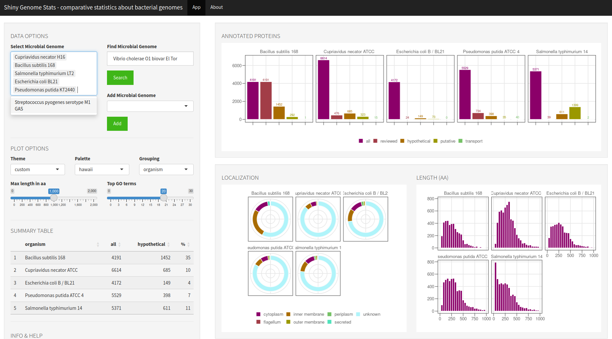

# Shiny Genome Stats

R Shiny app to show basic statistics and features of microbial genomes.

**Available on [Shinyapps.io](https://m-jahn.shinyapps.io/shiny-genome-stats/)!**

### Features

- shows **number of proteins** broken down by categories such as 'reviewed', 'hypothetical', etc.
- shows presumed **localization** of proteins
- shows **length**/size distribution of proteins
- summarized biological processes: top 20 GO terms by number of proteins annotated for the respective term
- genomic features: currently number, name and length of the different chromosomes/plasmids per strain
- if you like to see **more features, please request by posting a [github issue](https://github.com/m-jahn/shiny-genome-stats/issues)**

### Getting started

**Run the app at https://m-jahn.shinyapps.io/shiny-genome-stats/!**

If you want to run this app *locally*, you need to have R > 4.0.0 (optionally also Rstudio) and these libraries installed:

- `shiny`
- `httr`
- `jsonlite`
- `DT`
- `shinyWidgets`
- `tidyr`
- `dplyr`
- `readr`
- `ggplot2`
- `shinythemes`
- `shinyTree`
- `configr`
- `stringr`
- `colorspace`
- `forcats`
- `rentrez`

Open `global.R`, `server.R` or `ui.R` in RStudio and push the `Run App` button in Rstudio, done!
You can also run the app from R console, just call `runApp("path-to-ShinyApp")`.

### Input data

`shiny-genome-stats` retrieves data dynamically from [uniprot.org](https://www.uniprot.org) and [NCBI](https://www.ncbi.nlm.nih.gov/datasets/genome/).
In order to speed things up, the app comes with currently six microbial proteomes pre-downloaded.

- *Cupriavidus necator H16*, taxonomy ID `381666`
- *Bacillus subtilis 168*, taxonomy ID `224308`
- *Salmonella typhimurium LT2*, taxonomy ID `99287`
- *Escherichia coli BL21*, taxonomy ID `469008`
- *Pseudomonas putida KT2440*, taxonomy ID `160488`
- *Streptococcus pyogenes serotype M1 GAS*, taxonomy ID `301447`

### Structure

This app consists of a set of R scripts that determine the functionality.

- `global.R` loads packages, data sets, and `.yml` configuration files
- `server.R` contains the main body of functions. The server obtains input parameters from the GUI and adjusts the graphical output accordingly (changes charts on the fly)
- `ui.R` The GUI contains the interactive modules such as sliders and check boxes
- `R/<helper_functions>.R` - additional functions loaded when necessary, for example for data formatting and plotting

### Author(s)

- Dr. Michael Jahn
  - Affiliation: [Max-Planck-Unit for the Science of Pathogens](https://www.mpusp.mpg.de/) (MPUSP), Berlin, Germany
  - ORCID profile: https://orcid.org/0000-0002-3913-153X
  - github page: https://github.com/m-jahn
