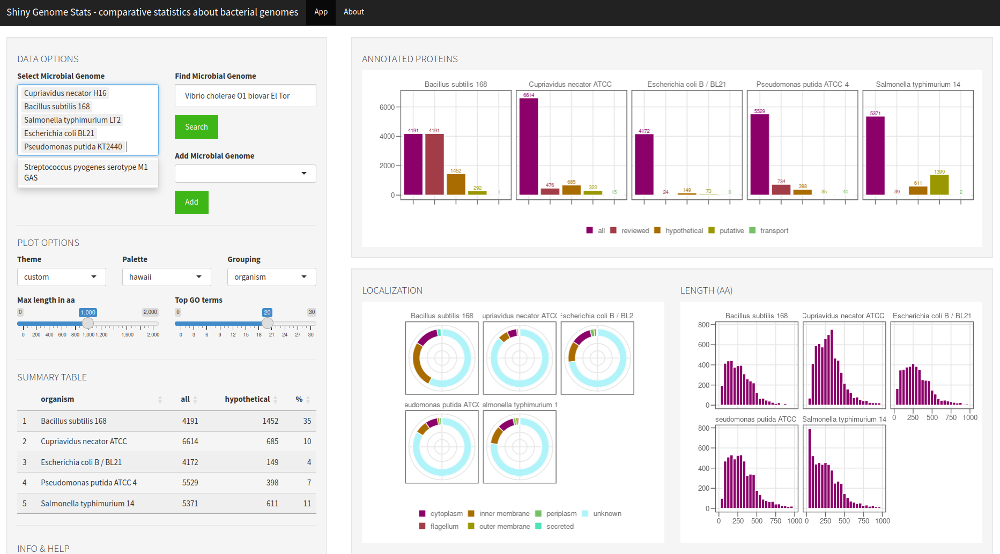

# Shiny Genome Stats

R Shiny app to show basic statistics and features of microbial genomes.

**Available on [Shinyapps.io](https://m-jahn.shinyapps.io/shiny-genome-stats/)!**



### Features

- shows **number of proteins** broken down by categories such as 'reviewed', 'hypothetical', etc.
- shows presumed **localization** of proteins
- shows **length**/size distribution of proteins
- summarized biological processes: top 20 GO terms by number of proteins annotated for the respective term
- genomic features: currently number, name and length of the different chromosomes/plasmids per strain
- if you like to see **more features, please request by posting a [github issue](https://github.com/m-jahn/shiny-genome-stats/issues)**

### Getting started

**Use the app at https://m-jahn.shinyapps.io/shiny-genome-stats/!**

#### Running Locally

If you want to run or develop this app *locally*, you need to have R > 4.0.0 and some additional packages installed.

This project is managed through [pixi](https://pixi.prefix.dev/latest/) environments and tasks (get pixi [here](https://pixi.prefix.dev/latest/installation/)).

The required R packages are listed in the `pixi.toml` file. In order to activate the `shiny` environment, run:

```bash
pixi shell -e shiny
```

And then run the app using:

```bash
R -e "shiny::runApp('.')"
```

There are predefined tasks in the `pixi.toml` file, so you might as well run the app with:

```bash
pixi run test
```

#### Alternative using Rstudio

Open `global.R`, `server.R` or `ui.R` in RStudio and push the `Run App` button in Rstudio, done!
You can also run the app from R console, just call `runApp("path-to-ShinyApp")`.

### Input data

`shiny-genome-stats` uses prefetched data from NCBI obtained through the [datasets CLI](https://www.ncbi.nlm.nih.gov/datasets/genome/). The prefetch step downloads genome packages and caches the relevant metadata locally.

In order to run the data fetching step, use:

```bash
pixi run fetch
```

This step will attempt to download genome sequence, annotation and metadata for each genome from a list of ~6000 representative reference strains compiled by the [fast.genomics web service](https://fast.genomics.lbl.gov/cgi/search.cgi).
The data will be downloaded using `scripts/prefetch_genomes.R` script and stored in `data/ncbi/`.

The following summary tables are stored in `data/` after the fetching step completes:

- `genome_summary.tsv` for assembly-level metrics such as chromosome count, GC content, GC skew, gene/CDS counts, and rRNA/tRNA counts
- `genome_sequences.tsv` for per-chromosome or per-plasmid sequence length and GC metrics
- `genome_features.tsv` for feature counts and feature lengths by annotation type

In order to clean the download dir, run:

```bash
pixi run clean
```

### Shiny App

This app consists of a set of R scripts that determine the functionality.

- `global.R` loads packages, data sets, and `.yml` configuration files
- `server.R` contains the main body of functions. The server obtains input parameters from the GUI and adjusts the graphical output accordingly (changes charts on the fly)
- `ui.R` The GUI contains the interactive modules such as sliders and check boxes
- `scripts/<helper_functions>.R` - additional functions loaded when necessary, for example for data formatting and plotting

### Author(s)

- Dr. Michael Jahn
  - Affiliation: [Max-Planck-Unit for the Science of Pathogens](https://www.mpusp.mpg.de/) (MPUSP), Berlin, Germany
  - ORCID profile: https://orcid.org/0000-0002-3913-153X
  - github page: https://github.com/m-jahn
