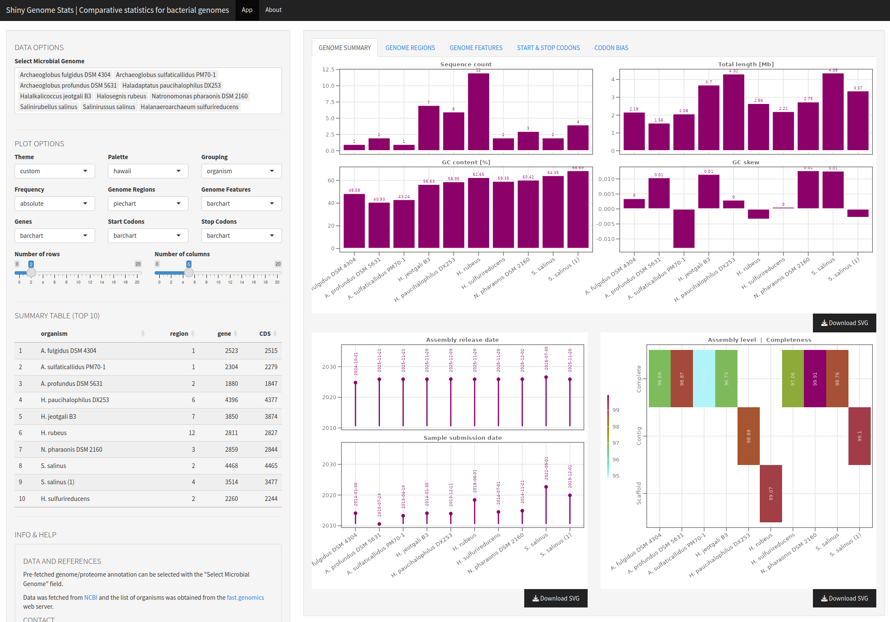

# Shiny Genome Stats

R Shiny app to show basic statistics and features of microbial genomes.

**Available on [Shinyapps.io](https://m-jahn.shinyapps.io/shiny-genome-stats/)!**



### Features

- shows a **genome summary** in terms of number of chromosomes or contigs, length, GC content and skew
- shows an **assembly summary** with sample submission and release, date, assmembly type and checkM completeness
- shows **genome features** such as CDS, rRNA, and tRNA counts, and CDS length distribution
- shows **start and stop codon** distribution
- if you like to see **more features, please create an [issue on GitHub](https://github.com/m-jahn/shiny-genome-stats/issues)**

### Getting started

**Use the app at https://m-jahn.shinyapps.io/shiny-genome-stats/!**

### Test and development

If you want to run or develop this app *locally*, you need to have R > 4.0.0 and some additional packages installed.

This project is managed through [pixi](https://pixi.prefix.dev/latest/) environments and tasks (get pixi [here](https://pixi.prefix.dev/latest/installation/)).

The required R packages are listed in the `pixi.toml` file.
In order to activate e.g. the `shiny` environment, run:

```bash
pixi shell -e shiny
```

And then run the app using:

```bash
R -e "shiny::runApp('.')"
```

There are predefined tasks in the `pixi.toml` file, and it is recommended to use them.

#### Input data

`shiny-genome-stats` uses prefetched data from NCBI obtained through the [datasets CLI](https://www.ncbi.nlm.nih.gov/datasets/genome/). The prefetch step downloads genome packages and caches the relevant metadata locally.

In order to run the data fetching step, use:

```bash
pixi run fetch
```

This step will attempt to download genome sequence, annotation and metadata for each genome from a list of ~6000 representative reference strains compiled by the [fast.genomics web service](https://fast.genomics.lbl.gov/cgi/search.cgi).
The list of representative genomes in `data/genomes.tsv` was obtained from http://fast.genomics.lbl.gov/, which is also licensed under the same terms (GNU GPL v3) as this project, and was downloaded 07 Nov 2024.
Data from NCBI will be downloaded using `scripts/prefetch_genomes.R` script and stored in `data/ncbi/`.

The following summary tables are stored in `data/` after the fetching step completes:

- `genome_summary.tsv` for assembly-level metrics such as chromosome count, GC content, GC skew, gene/CDS counts, and rRNA/tRNA counts
- `genome_sequences.tsv` for per-chromosome or per-plasmid sequence length and GC metrics
- `genome_features.tsv` for feature counts and feature lengths by annotation type

In order to collect codon statistics etc, run:

```bash
pixi run stats
```

After that, you can run the app using:

```bash
pixi run test
```

To deploy the app on [ShinyApps.io](https://www.shinyapps.io/), run:

```bash
pixi run deploy
```

Finally, in order to clean the download dir, run:

```bash
pixi run clean
```

### Shiny App structure

This app consists of a set of R scripts that determine its functionality.

- `global.R` loads packages, data sets, and `.yml` configuration files
- `server.R` contains the main body of functions. The server obtains input parameters from the GUI and adjusts the graphical output accordingly (changes charts on the fly)
- `ui.R` contains the GUI, which includes the interactive modules such as sliders and check boxes
- `scripts/<helper_functions>.R` - additional functions loaded when necessary, for example for data formatting and plotting

### Author(s)

- Dr. Michael Jahn
  - Affiliation: [Max-Planck-Unit for the Science of Pathogens](https://www.mpusp.mpg.de/) (MPUSP), Berlin, Germany
  - ORCID profile: https://orcid.org/0000-0002-3913-153X
  - github page: https://github.com/m-jahn
